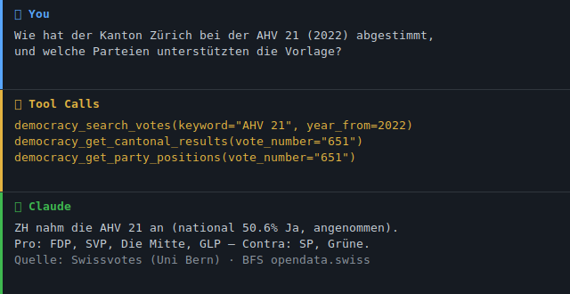

# 🗳️ swiss-democracy-mcp

[](https://github.com/malkreide/swiss-democracy-mcp/actions/workflows/ci.yml)
[](https://pypi.org/project/swiss-democracy-mcp/)
[](https://pypi.org/project/swiss-democracy-mcp/)
[](LICENSE)
[](https://modelcontextprotocol.io/)
[](https://github.com/malkreide/swiss-public-data-mcp)

> 🇨🇭 **Part of the [Swiss Public Data MCP Portfolio](https://github.com/malkreide/swiss-public-data-mcp)** — connecting AI models to Swiss institutional data sources.

🌐 **English** | **[🇩🇪 Deutsche Version](README.de.md)**

An MCP server providing access to Swiss direct democracy data, covering all federal popular votes since 1848 and elections since 1900.



---

## Demo Query

```
«Wie hat der Kanton Zürich bei der AHV 21 Initiative 2022 abgestimmt,
 und welche Parteien unterstützten die Vorlage?»
```

→ `democracy_search_votes(keyword="AHV 21", year_from=2022)`  
→ `democracy_get_cantonal_results(vote_number="551")`  
→ `democracy_get_party_positions(vote_number="551")`
[→ More use cases by audience →](EXAMPLES.md)

---

## Data Sources

| Source | Coverage | Auth |
|---|---|---|
| **[Swissvotes](https://swissvotes.ch)** (Uni Bern) | All federal votes since 1848 · 874 columns · party positions · cantonal results | None ✓ |
| **[BFS / opendata.swiss](https://opendata.swiss/de/dataset/echtzeitdaten-am-abstimmungstag-zu-eidgenoessischen-abstimmungsvorlagen)** | Real-time & archive (since 1981) · municipality level | None ✓ |
| **[SRGSSR Polis](https://developer.srgssr.ch/api-catalog/srgssr-polis)** | Votes & elections since 1900 · municipality detail | OAuth2 key |

---

## Tools

### Phase 1 — Swissvotes (No Auth Required)

| Tool | Description |
|---|---|
| `democracy_search_votes` | Search all federal popular votes since 1848 by keyword, date range, legal form, outcome, policy domain |
| `democracy_get_vote_detail` | Full details for a specific vote: official title, parliamentary positions, national result, signatures |
| `democracy_get_party_positions` | Party recommendations (FDP, SP, SVP, Die Mitte, GPS, GLP, …) with campaign finance data |
| `democracy_get_cantonal_results` | Results for all 26 cantons: yes%, turnout, accepted flag |
| `democracy_list_vote_dates` | List all voting dates with number of proposals per date |

### Phase 2 — BFS Real-Time (No Auth Required)

| Tool | Description |
|---|---|
| `democracy_bfs_list_vote_dates` | List all BFS voting dates (archive + current) |
| `democracy_bfs_get_vote_results` | Real-time or archived results at national, cantonal, or municipality level |

### Phase 3 — SRGSSR Polis (API Key Required)

| Tool | Description |
|---|---|
| `democracy_polis_list_votations` | Historical votations since 1900 with municipality-level data |
| `democracy_polis_get_votation_detail` | Full Polis detail, optionally with all municipality results |
| `democracy_polis_list_elections` | National Council, Council of States, and cantonal elections since 1900 |

---

## Installation

### Claude Desktop (stdio)

Add to `claude_desktop_config.json`:

```json
{
  "mcpServers": {
    "swiss-democracy": {
      "command": "uvx",
      "args": ["swiss-democracy-mcp"],
      "env": {
        "SRGSSR_CONSUMER_KEY": "your_key_here",
        "SRGSSR_CONSUMER_SECRET": "your_secret_here"
      }
    }
  }
}
```

> The `SRGSSR_*` variables are optional. Without them, all Swissvotes and BFS tools remain fully functional. Only the Polis tools require credentials.

### Cloud / Render.com (Streamable HTTP)

```bash
pip install swiss-democracy-mcp
# Bind to all interfaces ONLY inside a container/cloud environment:
MCP_TRANSPORT=streamable_http MCP_HOST=0.0.0.0 MCP_PORT=8000 python -m swiss_democracy_mcp.server
```

`MCP_HOST` defaults to `127.0.0.1` (loopback). Set `MCP_HOST=0.0.0.0` **only**
inside a sandboxed container/cloud deployment — never on a local machine, where
it would expose the server to your whole network.

---

## Architecture

```
┌─────────────────────────────────────────────┐
│              Claude / LLM Host              │
└──────────────┬──────────────────────────────┘
               │ MCP (stdio / Streamable HTTP)
┌──────────────▼──────────────────────────────┐
│         swiss-democracy-mcp                 │
│                                             │
│  ┌─────────────────────────────────────┐   │
│  │  Swissvotes CSV Cache (24h TTL)     │   │
│  │  All 874 columns, since 1848        │   │
│  └──────────────┬──────────────────────┘   │
│                 │                           │
│  ┌──────────────▼──────────────────────┐   │
│  │  BFS / opendata.swiss (no auth)     │   │
│  │  Real-time & archive since 1981     │   │
│  └──────────────┬──────────────────────┘   │
│                 │                           │
│  ┌──────────────▼──────────────────────┐   │
│  │  SRGSSR Polis (OAuth2, optional)    │   │
│  │  Votes & elections since 1900       │   │
│  └─────────────────────────────────────┘   │
└─────────────────────────────────────────────┘
```

**Transport:** stdio for Claude Desktop · Streamable HTTP for cloud/Render.com  
**Auth pattern:** No-Auth-First — Swissvotes & BFS work without any credentials  
**Cache:** Swissvotes CSV is loaded once at startup and cached for 24 hours

---

## Configuration

All configuration is via environment variables (see [`.env.example`](.env.example)):

| Variable | Default | Purpose |
|---|---|---|
| `MCP_TRANSPORT` | `stdio` | `stdio` (local) or `streamable_http` (cloud) |
| `MCP_HOST` | `127.0.0.1` | HTTP bind address — set `0.0.0.0` **only** in a container |
| `MCP_PORT` | `8000` | HTTP port |
| `LOG_LEVEL` | `INFO` | structured JSON logs go to **stderr** |
| `SRGSSR_CONSUMER_KEY` / `SRGSSR_CONSUMER_SECRET` | — | optional, only for `democracy_polis_*` tools |

Secrets are held as `SecretStr` and never logged. See
[docs/secret-management.md](docs/secret-management.md) and
[docs/security.md](docs/security.md).

## MCP Primitives

This server intentionally exposes **Tools only** (no Resources or Prompts). It is
a Phase-1 read-only data wrapper (see [docs/roadmap.md](docs/roadmap.md)); the
tool surface is small (10 use-case-oriented tools) and every response is
self-contained with source provenance. Resources (e.g. `vote://{anr}`) are a
candidate for a later phase once the URI scheme stabilises.

## MCP Protocol Version

The protocol version is the one negotiated by `mcp[cli]>=1.6.0` (FastMCP). SDK
updates are tracked monthly via Dependabot; protocol bumps are recorded in
[CHANGELOG.md](CHANGELOG.md).

---

## Portfolio Synergy

Combine with other servers in the Swiss Public Data MCP portfolio:

- **[zurich-opendata-mcp](https://github.com/malkreide/zurich-opendata-mcp)** — add Zurich city-level statistics to vote analysis
- **[swiss-statistics-mcp](https://github.com/malkreide/swiss-statistics-mcp)** — enrich with BFS demographic data by canton
- **[srgssr-mcp](https://github.com/malkreide/srgssr-mcp)** — link SRF news archive content to specific vote dates

Example multi-server query:  
*«Vergleiche die Abstimmungsresultate zur AHV-Reform mit der Altersstruktur der Kantone»*  
→ `swiss-democracy-mcp` + `swiss-statistics-mcp`

---

## Safety & Limits

- **Read-only:** All tools perform HTTP GET requests only — no data is written, modified, or deleted upstream.
- **Egress allow-list (SSRF protection):** Outbound requests are restricted to a fixed allow-list of trusted hosts (`swissvotes.ch`, `opendata.swiss`, `*.bfs.admin.ch`, `api.srgssr.ch`), HTTPS only. Caller-supplied URLs (the BFS `result_url`) are additionally resolved and rejected if they point at private, loopback or cloud-metadata IP ranges.
- **No personal data:** Swissvotes, BFS and SRGSSR Polis expose aggregate democratic data (vote results, party positions, cantonal/municipality tallies). No personally identifiable information (PII) is processed or stored by this server.
- **Rate limits:** Swissvotes is a single CSV downloaded once per 24h and cached in memory. BFS / opendata.swiss and SRGSSR Polis are public APIs without documented rate limits — keep `limit` and date ranges conservative. The server enforces a 30s timeout per request.
- **Data freshness:** Real-time BFS results reflect the upstream feed at query time (no local caching). Swissvotes is refreshed every 24h from the Uni Bern mirror.
- **Terms of service:** Data is subject to the ToS of each source — [swissvotes.ch](https://swissvotes.ch) (CC BY 4.0, Uni Bern), [opendata.swiss](https://opendata.swiss) (mostly CC-BY / Open by Default), [SRGSSR Polis](https://developer.srgssr.ch) (free tier, non-commercial use only). Always cite the upstream source in downstream products.
- **No guarantees:** This server is a community project, not affiliated with the University of Bern, the Federal Statistical Office, or SRG SSR. Availability depends on upstream APIs.

---

## Known Limitations

- **Swissvotes coverage:** Cantonal-level results are available since 1848; municipality-level results only via SRGSSR Polis (since ~1990s depending on the vote).
- **BFS archive:** Real-time service covers federal votes since 1981 only.
- **Polis tools:** Require free registration at [developer.srgssr.ch](https://developer.srgssr.ch). Non-commercial use only.
- **CSV cache:** The Swissvotes dataset is ~several MB and is cached in memory for 24 hours. Memory footprint is accordingly higher than API-only servers.

---

## Testing

```bash
# Unit tests (no network required)
PYTHONPATH=src pytest tests/ -m "not live" -v

# Live tests (require network access)
PYTHONPATH=src pytest tests/ -m "live" -v
```

---

## Contributing

See [CONTRIBUTING.md](CONTRIBUTING.md) ([🇩🇪 Deutsch](CONTRIBUTING.de.md)).

---

## Security

See [SECURITY.md](SECURITY.md) ([🇩🇪 Deutsch](SECURITY.de.md)) for the security posture and vulnerability reporting.

---

## License

MIT — see [LICENSE](LICENSE).

Data licenses:
- Swissvotes: [Creative Commons BY 4.0](https://creativecommons.org/licenses/by/4.0/)
- BFS / opendata.swiss: [Open use](https://opendata.swiss/de/terms-of-use)
- SRGSSR Polis: Non-commercial use only — see [developer.srgssr.ch](https://developer.srgssr.ch)

<!-- mcp-name: io.github.malkreide/swiss-democracy-mcp -->

<!-- BEGIN GENERATED: install -->
## Installation

Run via [`uv`](https://docs.astral.sh/uv/)'s `uvx` — no clone or manual install needed. Add to your MCP client config (`mcpServers` for Claude Desktop, Cursor and Windsurf; use a top-level `servers` key for VS Code in `.vscode/mcp.json`):

```json
{
  "mcpServers": {
    "swiss-democracy-mcp": {
      "command": "uvx",
      "args": [
        "swiss-democracy-mcp"
      ]
    }
  }
}
```
<!-- END GENERATED: install -->
